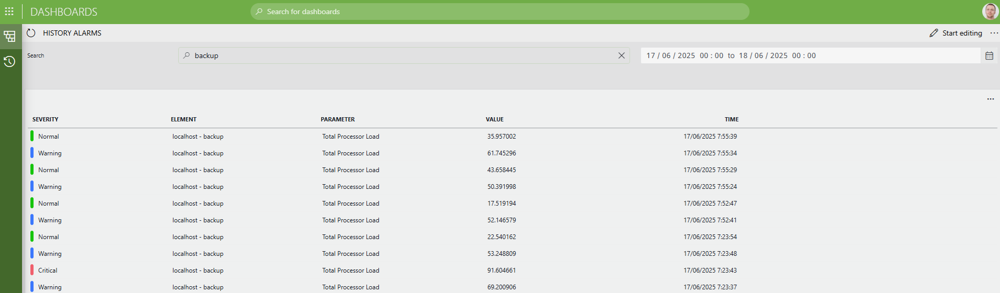

# History Alarms Data Source

## About

The **History Alarms Data Source** enables users to efficiently retrieve and analyze historical alarm data from their DataMiner System.

## Key Features

- **Time range filtering**: Specify a required start time (`From`) and an optional end time (`Until`) to only retrieve alarms within a particular period.
- **Search functionality**: Filter alarms by specifying a search term that matches the element name, parameter name, or parameter value.
- **Efficient paging**: Handles large alarm sets with server-side paging for optimal performance and scalability.

## Input & Output

### Input

Arguments:

- **From** (`DateTime`, required): Start of the time range.
- **Until** (`DateTime`, optional): End of the time range.
- **Search term** (`String`, optional): Text to be searched in element names, parameter names, or parameter values.

### Output

Columns:

- **Severity**
- **Element**
- **Parameter**
- **Value**
- **Time**
- **Root ID**
- **ID**

## Use Cases

- **Incident analysis**: Quickly retrieve all alarms that occurred during a specific incident window.
- **Root cause investigation**: Search for alarms related to specific elements, parameters, or parameter values for troubleshooting purposes.
- **Historical reporting**: Generate reports on alarm trends and patterns over custom time ranges.
- **Compliance auditing**: Review alarm history for auditing and regulatory compliance purposes.

## Prerequisites

- DataMiner System without GQI DxM (DxM support is currently under development)
